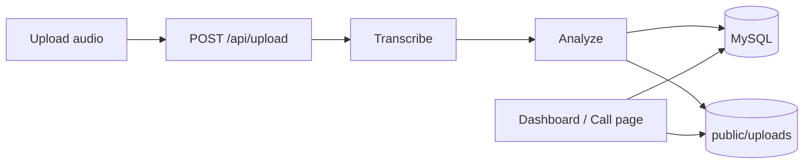

# vibe-coding-project
vibe-coding-project
=======
# README #
=======
# Call Intelligence Platform

Prototype **AI-powered sales call analytics**: upload audio, get transcripts, sentiment, agent scores, discovery coverage, keywords, and follow-up action items. Built for rapid **Vibe Coding** iteration (Next.js + optional OpenAI).

## Architecture

| Layer | Responsibility |
|--------|----------------|
| **Next.js App Router** | Dashboard UI, call detail UI, API routes |
| **`src/lib/ai-pipeline.ts`** | Transcription (Whisper when configured) + structured analysis (chat model or heuristics) |
| **`src/lib/mysql.ts`** | **MySQL** connection pool + auto-creates `calls` table |
| **`src/lib/store.ts`** | Read/write calls (`saveCall`, `getCall`, `listCalls`) |
| **`public/uploads/`** | Audio files only; transcript + analysis JSON live in MySQL |



## Features (hackathon checklist)

- **Main dashboard**: total calls, sentiment split, average score, average duration, top keywords, action-item count, call table.
- **Call detail**: summary, sentiment, overall score, audio player + click-to-seek transcript, talk-time split, five agent dimensions (1–10), discovery questionnaire table, keywords, action items, positive/negative observations.
- **No API key**: deterministic mock transcript + heuristic analysis so the UI runs locally for demos.

## Setup

**Requirements:** Node.js 18+, **MySQL 5.7+** (or MariaDB 10.2+) with a database and user that can create tables.

* Repo owner or admin
* Other community or team contact

```bash
# Create DB if needed (see scripts/mysql-init.sql)
cp .env.example .env.local
# Edit .env.local: MYSQL_* and optional OPENAI_API_KEY

npm install
npm run dev
```

Open [http://localhost:3000](http://localhost:3000), upload an audio file, then open the generated call page.

**Production build:**

```bash
npm run build
npm start
```

## Environment variables

| Variable | Required | Purpose |
|----------|----------|---------|
| `MYSQL_HOST` | Yes* | Default `localhost` |
| `MYSQL_PORT` | No | Default `3306` |
| `MYSQL_USER` | Yes | Database user |
| `MYSQL_PASSWORD` | Yes | Database password (quote if it contains `@` or `#`) |
| `MYSQL_DATABASE` | Yes | e.g. `vibe-coding-project` |
| `OPENAI_API_KEY` | No | Whisper + GPT analysis |
| `OPENAI_ANALYSIS_MODEL` | No | Defaults to `gpt-4o-mini` |

\*If unset, defaults are only applied where noted; `MYSQL_USER` and `MYSQL_DATABASE` must be set.

## Code layout

```
src/
  app/
    page.tsx              # Main dashboard
    calls/[id]/page.tsx   # Per-call intelligence view
    api/
      upload/route.ts     # Ingest + pipeline
      calls/route.ts      # List + aggregates
      calls/[id]/route.ts # Single call
  components/             # Stat cards, upload, table
  lib/
    types.ts
    mysql.ts
    store.ts
    aggregate.ts
    questionnaire.ts
    ai-pipeline.ts
    heuristic-analysis.ts
    mock-transcript.ts
scripts/mysql-init.sql    # Optional: CREATE DATABASE
public/uploads/           # Audio files (gitignored except .gitkeep)
PROMPT_LOG.md             # Fill in for hackathon deliverable
```

## Deliverables

- **Working prototype:** `npm run dev`
- **Prompt log:** edit `PROMPT_LOG.md`
- **Demo video:** walk through upload → dashboard → call detail (5–7 min)
- **BitBucket:** push this repository

## Notes

- **MySQL** must be reachable from the Node process (`next dev` / `next start`). The app creates the `calls` table on first use.
- **Large uploads:** On some hosts request body limits apply. For big WAV files, adjust your reverse proxy or app server limits.
- **Speaker diarization:** Whisper segments are labeled alternately agent/customer unless you add a dedicated diarization step; scores still reflect talk-time ratios from that labeling.

## License

Use and modify for the hackathon submission.
