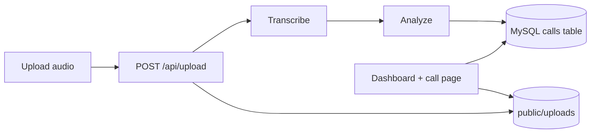

# Call Intelligence Platform

AI-powered sales call analytics prototype. Upload a recording, then get transcript, sentiment, coaching scores, discovery coverage, keywords, and follow-up actions.

**Repository:** [github.com/pankaj23591/vibe-coding-project](https://github.com/pankaj23591/vibe-coding-project)

## What this app does

- Uploads audio from the dashboard.
- Transcribes calls using OpenAI Whisper (or uses deterministic mock transcript when no API key is configured).
- Runs structured analysis with GPT (or local heuristic analysis fallback).
- Stores call metadata, transcript JSON, and analysis JSON in MySQL.
- Stores uploaded audio under `public/uploads`.
- Shows aggregate dashboard and per-call detail page.
- Supports deleting a call from the recording library (removes DB row + uploaded audio file).

## Architecture

| Layer | Responsibility |
|--------|----------------|
| `src/app` | Next.js App Router pages and API routes |
| `src/lib/ai-pipeline.ts` | Transcription + analysis orchestration |
| `src/lib/mysql.ts` | MySQL pool initialization, optional auto `CREATE DATABASE`, table bootstrap |
| `src/lib/store.ts` | Data access (`saveCall`, `getCall`, `listCalls`, `deleteCall`) |
| `public/uploads/` | Uploaded call audio files |



## Requirements

- Node.js 18+ (Node 20 recommended)
- npm 9+
- MySQL 5.7+ (or MariaDB 10.2+)

## Quick start

```bash
git clone https://github.com/pankaj23591/vibe-coding-project.git
cd vibe-coding-project
cp .env.example .env.local
# Fill MYSQL_* values, and optional OPENAI_* values
npm install
npm run dev
```

Open [http://localhost:3000](http://localhost:3000).

## Database setup (full detail)

The app supports two setup modes:

### Mode A: Auto-create database and table (default)

If your MySQL user has create-database privileges, the app runs:

- `CREATE DATABASE IF NOT EXISTS <MYSQL_DATABASE>`
- `CREATE TABLE IF NOT EXISTS calls (...)`

No manual SQL is required in this mode.

### Mode B: Manual database creation + auto table creation

If your DB user cannot create databases, create it once manually:

```bash
mysql -u root -p < scripts/mysql-init.sql
```

Then set this in `.env.local`:

```bash
MYSQL_SKIP_AUTOCREATE_DB=1
```

The app still auto-creates the `calls` table on first request.

## Table schema

The app keeps one table named `calls`:

```sql
CREATE TABLE IF NOT EXISTS calls (
  id VARCHAR(128) NOT NULL PRIMARY KEY,
  created_at VARCHAR(64) NOT NULL,
  original_filename VARCHAR(512) NOT NULL,
  audio_relative_path VARCHAR(512) NOT NULL,
  transcript_json LONGTEXT NOT NULL,
  analysis_json LONGTEXT NOT NULL,
  KEY idx_calls_created_at (created_at)
) ENGINE=InnoDB DEFAULT CHARSET=utf8mb4 COLLATE=utf8mb4_unicode_ci;
```

### Stored data model

- `id`: unique call id.
- `created_at`: ISO timestamp string.
- `original_filename`: original uploaded file name.
- `audio_relative_path`: relative path like `uploads/<id>.<ext>`.
- `transcript_json`: array of transcript segments.
- `analysis_json`: full computed call analysis payload.

## Environment variables

| Variable | Required | Details |
|----------|----------|---------|
| `MYSQL_HOST` | No | Default `localhost` |
| `MYSQL_PORT` | No | Default `3306` |
| `MYSQL_USER` | Yes | Database user |
| `MYSQL_PASSWORD` | Yes | Database password |
| `MYSQL_DATABASE` | Yes | Example: `vibe-coding-project` |
| `MYSQL_SKIP_AUTOCREATE_DB` | No | `1` disables auto database creation |
| `OPENAI_API_KEY` | No | Enables Whisper + GPT analysis |
| `OPENAI_PROJECT_ID` | No | Needed for some project-scoped keys |
| `OPENAI_ORG_ID` | No | Optional org routing |
| `OPENAI_ANALYSIS_MODEL` | No | Defaults to `gpt-4o-mini` |

## API endpoints

| Method | Route | Purpose |
|--------|-------|---------|
| `POST` | `/api/upload` | Upload file, process transcript + analysis, persist call |
| `GET` | `/api/calls` | Dashboard payload (calls + aggregate stats) |
| `GET` | `/api/calls/:id` | Fetch one call |
| `DELETE` | `/api/calls/:id` | Delete one call and its uploaded audio |

## Build and run

```bash
npm run build
npm start
```

## Troubleshooting

- **`Cannot find module 'caniuse-lite/...'`**: run `npm install` again.
- **DB auth/connection failures**: verify `MYSQL_*` in `.env.local` and confirm user permissions.
- **No OpenAI key**: app still works using mock transcript + heuristic analysis.
- **Large upload issues**: increase reverse proxy/body size limits.

## Project layout

```text
src/
  app/
    page.tsx              # Dashboard
    calls/[id]/page.tsx   # Call detail
    api/
      upload/route.ts     # Upload + process + save
      calls/route.ts      # List + aggregates
      calls/[id]/route.ts # Get/delete one call
  components/             # UI cards, tables, upload
  lib/                    # Pipeline, DB, store, analysis logic
scripts/mysql-init.sql    # Manual DB bootstrap helper
public/uploads/           # Uploaded audio files
```

## License

Use and modify for hackathon submission.
